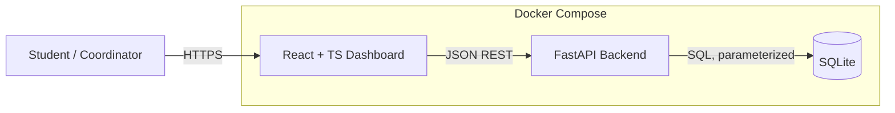
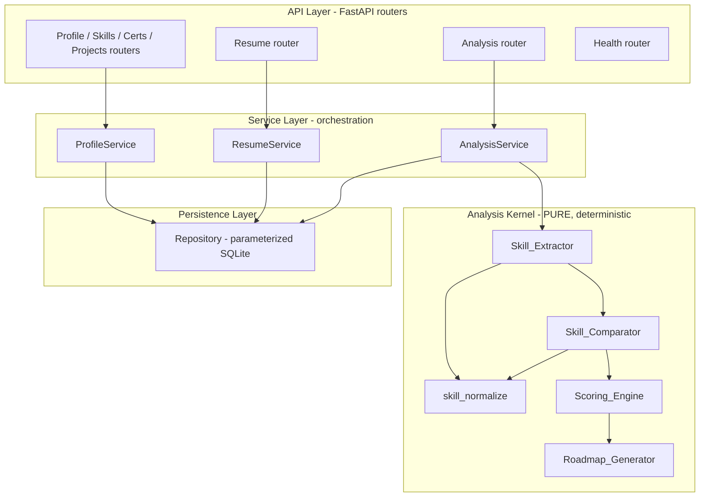
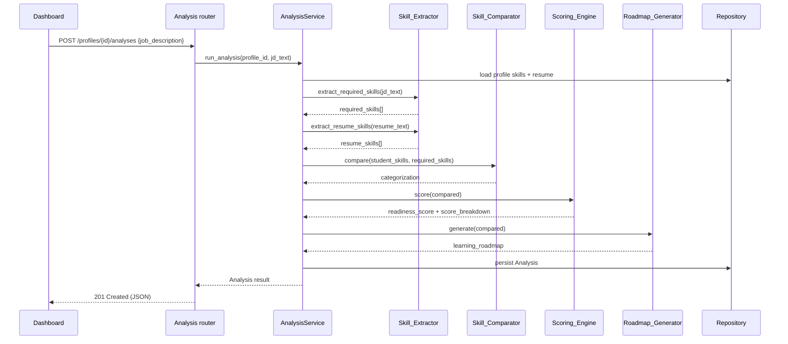
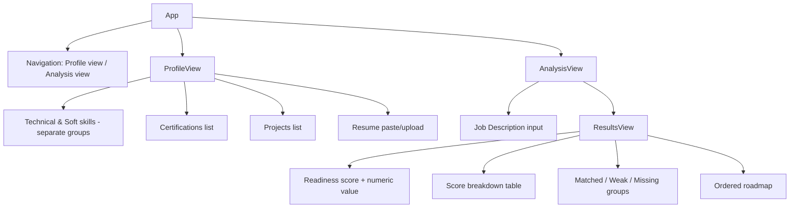
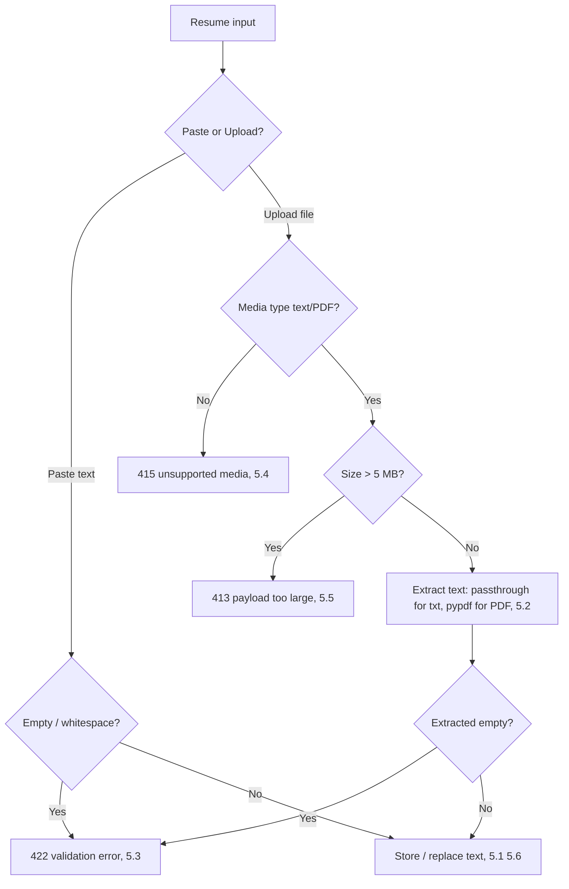
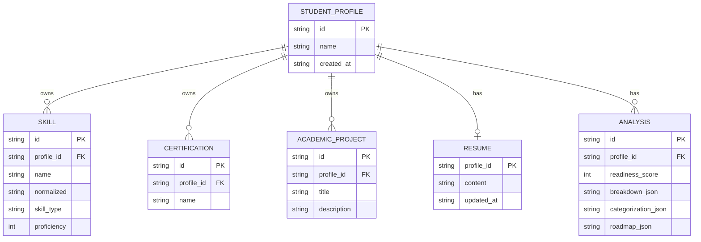
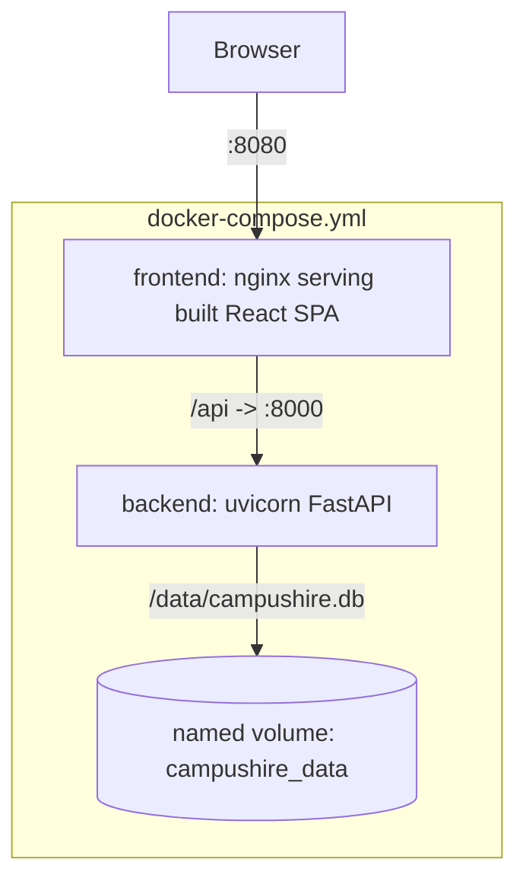

# Design Document

## Overview

CampusHire AI is a placement-readiness and skill-gap analyzer delivered as a React + TypeScript single-page dashboard talking to a Python + FastAPI backend over a JSON REST API, with SQLite for persistence and Docker for packaging. The correctness-critical core is a set of four deterministic, pure backend components — `Skill_Extractor`, `Skill_Comparator`, `Scoring_Engine`, and `Roadmap_Generator` — that transform a student profile and a target job description into a transparent 0–100 readiness score, a categorized gap report, and a prioritized learning roadmap.

The central design principle is that the analysis pipeline is a **deterministic, side-effect-free function**: identical inputs always produce identical outputs (Requirements 7.5, 9.1, 10.2, 12.5), and every point of the score is traceable to a contributing factor (Requirement 10.3, 10.10). This determinism is what makes property-based testing meaningful, so the design deliberately isolates the pure analysis logic from all I/O (HTTP, database, file parsing). Persistence and transport are thin adapters around a pure computational kernel.

This design addresses all functional requirements (1–16), non-functional requirements for performance, reliability, portability (17–19), and the testability, maintainability, usability, and security requirements (20–23).

### Technology Stack

| Layer | Choice | Rationale |
|-------|--------|-----------|
| Frontend | React 18 + TypeScript + Vite | Type-safe SPA; Vite for fast dev/build; matches the "React + TypeScript" requirement in the introduction. |
| Backend | Python 3.11 + FastAPI + Pydantic v2 | Async REST framework with schema validation at the boundary (Requirements 15.2, 18.2); Pydantic enforces field-level rules. |
| Persistence | SQLite (`sqlite3` stdlib, parameterized) | Zero-config embedded DB (Requirement 16.1); parameterized queries satisfy 23.2; file on a mounted volume for durability (19.3). |
| PDF parsing | `pypdf` (pure-Python) | Deterministic, dependency-light text extraction for resume upload (5.2). |
| Testing | `pytest` + `hypothesis` | Example/edge/integration tests plus property-based tests for the kernel (Requirement 20). |
| Packaging | Docker + Docker Compose | Reproducible frontend + backend + mounted volume (Requirement 19). |

### Key Design Decisions

- **Pure kernel, thin adapters.** The four analysis components are pure functions over plain data structures. FastAPI routers, the SQLite repository, and the resume file parser are adapters that marshal data in and out. This keeps the property-tested surface free of database or network nondeterminism (supports Requirements 9, 10, 12, 20).
- **Deterministic ordering everywhere.** Any operation that emits a collection (extraction, comparison, roadmap) sorts by an explicit, total ordering key. No result ever depends on Python dict/set iteration order or database row order (Requirements 7.3–7.5, 9.2–9.3, 12.2–12.5).
- **Integer point conservation via largest-remainder rounding.** The score is an integer 0–100 whose per-skill contributions sum exactly to the total. Fractional weighted allocations are reconciled with the Hamilton/largest-remainder method with deterministic tie-breaking (Requirement 10.3, 10.4, 10.13).
- **Case-insensitive, whitespace-normalized skill matching.** All skill-name matching uses a single canonicalization function so declared skills, resume-derived skills, and required skills compare consistently (Requirements 2.6, 7.3, 7.4, 8.1).

## Architecture

### System Context



The Dashboard communicates with the backend exclusively through the REST API (Requirement 14.5). The backend owns all business logic and persistence. Everything is packaged as Docker services with SQLite on a mounted volume so data survives restarts (Requirements 19.1–19.3, 16.2).

### Backend Layered Architecture



The layers enforce a strict dependency direction: routers depend on services, services depend on the kernel and the repository, and the kernel depends on nothing but the shared `skill_normalize` helper and the standard library. The kernel never imports FastAPI, sqlite3, or file I/O — a structural guarantee that supports determinism and property-testability (Requirement 20).

### Analysis Pipeline



## Components and Interfaces

All kernel components are pure functions expressed here with Python type signatures. Inputs and outputs are immutable dataclasses (`frozen=True`) so results cannot be mutated after computation.

### Shared: `skill_normalize`

```python
def skill_normalize(name: str) -> str:
    """Canonical form for case-insensitive, whitespace-tolerant matching.
    Trims, collapses internal whitespace runs to a single space, lowercases."""
    return re.sub(r"\s+", " ", name).strip().lower()
```

Used by extractor, comparator, and duplicate detection to guarantee a single consistent matching rule (Requirements 2.6, 7.3, 7.4, 8.1). The function is **idempotent** (`normalize(normalize(x)) == normalize(x)`) and invariant to case and to surrounding/internal whitespace — properties asserted directly in the test suite (Property 1).

### `Skill_Extractor`

Responsible for deriving `Required_Skill` entries from a `Job_Description` and derived skills from a `Resume` (Requirement 7).

```python
@dataclass(frozen=True)
class RequiredSkill:
    name: str          # display name (normalized form used for matching)
    weight: int        # importance 1..5 inclusive

def extract_required_skills(job_description: str) -> list[RequiredSkill]:
    """Deterministically extract required skills from JD text.
    - Matches skill names against a curated skill dictionary (keyword + alias table).
    - Normalizes names (7.4), de-duplicates case-insensitively (7.3).
    - Assigns importance weight 1..5 (7.2) from deterministic signals
      (frequency, section, required/preferred phrasing).
    - Returns list sorted by normalized name for a stable, deterministic order (7.5).
    """

def extract_resume_skills(resume_text: str | None) -> list[str]:
    """Deterministically derive candidate skill names from resume text
    using the same skill dictionary and normalization. Returns normalized names."""
```

Design notes:
- Extraction is dictionary/rule based (a curated skill vocabulary with aliases), not model-based, precisely so it is deterministic and reproducible for the evaluator (Requirement 7.5). No randomness, no wall-clock, no network.
- Weighting signals are fixed functions of the text (term frequency bucketed into 1–5, boosted when appearing under a "required"/"must have" cue), clamped to the 1–5 range (Requirement 7.2).
- An empty extraction result is a valid outcome and is propagated to the scoring stage (Requirement 7.6).

### `Skill_Comparator`

Compares the union of declared and resume-derived student skills against the required set and categorizes each required skill (Requirements 8, 9).

```python
class Category(str, Enum):
    MATCHED = "matched"
    WEAK = "weak"
    MISSING = "missing"

PROFICIENCY_THRESHOLD = 3

@dataclass(frozen=True)
class StudentSkill:
    name: str
    proficiency: int   # 1..5

@dataclass(frozen=True)
class ComparedSkill:
    name: str
    weight: int
    category: Category
    proficiency: int | None   # present for matched/weak, None for missing

def compare(student_skills: list[StudentSkill],
            required_skills: list[RequiredSkill]) -> list[ComparedSkill]:
    """For each Required_Skill (8.5 exactly one category):
    - Build a map normalized-name -> max proficiency over student skills
      (union of declared + resume-derived), so ordering of student input
      is irrelevant (9.2).
    - MATCHED if a match exists with proficiency >= 3 (8.2)
    - WEAK if a match exists with proficiency < 3 (8.3)
    - MISSING if no match exists (8.4)
    Result is sorted by normalized name for order-invariant output (9.1, 9.3).
    Count(matched)+count(weak)+count(missing) == len(required) (8.6)."""
```

Design notes:
- Resume-derived skills that are not declared are treated as declared at the default proficiency of 1, unless a declared skill of the same name has a higher proficiency (in which case the max wins). This keeps the union rule simple and order-invariant (Requirement 8.1).
- Because the student skill set is reduced to a name→max-proficiency map before categorization, reordering the student list or the required list cannot change the result (Requirements 9.2, 9.3).

### `Scoring_Engine`

Computes the transparent, deterministic `Readiness_Score` and `Score_Breakdown` (Requirement 10). This is the most correctness-critical component.

```python
@dataclass(frozen=True)
class BreakdownItem:
    name: str
    weight: int
    category: Category
    points: int        # integer point contribution

@dataclass(frozen=True)
class ScoreResult:
    readiness_score: int          # 0..100
    breakdown: list[BreakdownItem]

CATEGORY_FACTOR = {           # fraction of a skill's weighted capacity earned
    Category.MATCHED: 1.0,
    Category.WEAK: 0.5,
    Category.MISSING: 0.0,
}

def score(compared: list[ComparedSkill]) -> ScoreResult:
    """Compute readiness score. See "Scoring Algorithm" below for the exact,
    conservation-preserving, integer largest-remainder procedure."""
```

The precise algorithm is specified in its own section below because its correctness properties (conservation, bounds, monotonicity, determinism) are the heart of the spec.

### `Roadmap_Generator`

Produces the prioritized `Learning_Roadmap` (Requirement 12).

```python
@dataclass(frozen=True)
class RoadmapItem:
    name: str
    weight: int
    category: Category    # MISSING or WEAK only
    priority_rank: int    # 1-based position in the ordered list

def generate(compared: list[ComparedSkill]) -> list[RoadmapItem]:
    """One item per Missing_Skill and Weak_Skill; Matched excluded (12.1, 12.6).
    Sort key (total order, deterministic - 12.5):
      1. weight DESC (12.2)
      2. category: MISSING before WEAK (12.3)
      3. normalized name ASC (12.4)
    priority_rank assigned 1..N after sorting."""
```

### Service Layer

- **ProfileService** — CRUD for profiles, skills, certifications, projects; enforces validation rules (non-empty names, proficiency range 1–5, default proficiency 1, case-insensitive duplicate rejection) (Requirements 1–4).
- **ResumeService** — accepts pasted text or uploaded file; extracts text from plain text/PDF; enforces content, media-type, and 5 MB size rules; replaces existing resume (Requirement 5).
- **AnalysisService** — orchestrates the kernel pipeline, persists the `Analysis`, and returns the assembled result (Requirements 8–13).

### Frontend Dashboard Structure



Frontend components:
- **App shell / router** — navigation between profile and analysis views (Requirement 14.1).
- **ProfileView** — renders active profile name + id (1.6), technical and soft skills as separate labeled groups (2.8), certifications (3.4) re-fetched on active-profile change (3.5), and projects with titles/descriptions (4.5).
- **AnalysisView** — job description input area (6.4), in-progress indicator while running (14.3), and a single ResultsView showing score, breakdown, gap categorization, and roadmap (14.2, 11.3, 12.7).
- **ApiClient** — a typed fetch wrapper; the only path to the backend (14.5). Surfaces API errors as human-readable messages (14.4) shown adjacent to the relevant input on validation failures (22.3).

State is kept per active profile; changing the active profile triggers re-fetch of dependent lists.

## Resume and Job-Description Processing

Both resume and job-description handling are I/O adapters at the boundary that reduce raw input to clean text before it reaches the pure kernel.

### Resume ingestion (Requirement 5)



- **Paste** stores the text directly (5.1); **upload** extracts text — plain text is passed through, PDF is parsed via `pypdf` (5.2).
- **Guards, in order**: media type must be `text/plain` or `application/pdf` else 415 (5.4); size must be ≤ 5 MB else 413 (5.5); resulting text must be non-empty else 422 (5.3). Nothing is persisted when any guard fails.
- Submitting a resume when one already exists **replaces** the prior text; the `resume` table is keyed by `profile_id` so exactly one resume exists per profile (5.6).

### Job-description processing (Requirement 6)

- Accepted only when non-empty (non-whitespace) and ≤ 20000 characters; otherwise 422 and no analysis starts (6.2, 6.3).
- Accepted text is passed to the `Skill_Extractor` and associated with the resulting `Analysis` (6.1).
- The Dashboard provides a labeled text area for entry (6.4, 22.1).

## Skill Extraction and Normalization

Extraction is deliberately **rule-based and deterministic** (no ML inference, randomness, clock, or network) so identical text always yields identical required-skill sets (Requirement 7.5).

### Curated skill vocabulary

A static dictionary maps canonical skill names to alias sets, e.g. `{"javascript": {"js", "ecmascript"}, "postgresql": {"postgres", "psql"}}`. The dictionary is versioned in source control so results are reproducible for the evaluator.

### Extraction procedure

1. Scan the text for each vocabulary entry and its aliases (whole-token, case-insensitive).
2. For every hit, record the canonical name and accumulate deterministic weighting signals:
   - term frequency bucketed into 1–5, and
   - a boost when the term appears under a "required" / "must have" cue versus "preferred" / "nice to have".
3. Clamp the resulting weight to the 1–5 range (7.2).
4. Normalize every name with `skill_normalize` (7.4), then de-duplicate case-insensitively, keeping the highest weight on collision (7.3).
5. Sort the output by normalized name to fix a stable order (7.5).

### Normalization rule (`skill_normalize`)

- Trim leading/trailing whitespace, collapse internal whitespace runs to a single space, lowercase (7.4).
- Applied uniformly to declared skills (for duplicate detection, 2.6), resume-derived skills, and required skills so all three compare under one rule (8.1).
- The rule is idempotent and case/whitespace-invariant, which the property suite verifies directly.

An empty extraction result (no vocabulary hits) is not an error: it flows to scoring, which yields a score of 0 and an empty breakdown (7.6, 10.12).

## Data Models

### SQLite Schema

All tables use parameterized queries only (Requirement 23.2). Foreign keys use `ON DELETE CASCADE` so deleting a profile removes all owned data (Requirement 16.3). `PRAGMA foreign_keys = ON` is enabled per connection.

```sql
CREATE TABLE student_profile (
    id          TEXT PRIMARY KEY,          -- UUID
    name        TEXT NOT NULL CHECK (length(trim(name)) > 0),
    created_at  TEXT NOT NULL
);

CREATE TABLE skill (
    id            TEXT PRIMARY KEY,
    profile_id    TEXT NOT NULL REFERENCES student_profile(id) ON DELETE CASCADE,
    name          TEXT NOT NULL,
    normalized    TEXT NOT NULL,                    -- skill_normalize(name)
    skill_type    TEXT NOT NULL CHECK (skill_type IN ('technical','soft')),
    proficiency   INTEGER NOT NULL DEFAULT 1
                    CHECK (proficiency BETWEEN 1 AND 5),
    UNIQUE (profile_id, skill_type, normalized)     -- case-insensitive dedupe (2.6)
);

CREATE TABLE certification (
    id          TEXT PRIMARY KEY,
    profile_id  TEXT NOT NULL REFERENCES student_profile(id) ON DELETE CASCADE,
    name        TEXT NOT NULL CHECK (length(trim(name)) > 0)
);

CREATE TABLE academic_project (
    id          TEXT PRIMARY KEY,
    profile_id  TEXT NOT NULL REFERENCES student_profile(id) ON DELETE CASCADE,
    title       TEXT NOT NULL CHECK (length(trim(title)) > 0),
    description TEXT
);

CREATE TABLE resume (
    profile_id  TEXT PRIMARY KEY REFERENCES student_profile(id) ON DELETE CASCADE,
    content     TEXT NOT NULL,                       -- one resume per profile (5.6)
    updated_at  TEXT NOT NULL
);

CREATE TABLE analysis (
    id                  TEXT PRIMARY KEY,
    profile_id          TEXT NOT NULL REFERENCES student_profile(id) ON DELETE CASCADE,
    job_description     TEXT NOT NULL,
    readiness_score     INTEGER NOT NULL CHECK (readiness_score BETWEEN 0 AND 100),
    breakdown_json      TEXT NOT NULL,   -- serialized Score_Breakdown
    categorization_json TEXT NOT NULL,   -- matched/weak/missing lists
    roadmap_json        TEXT NOT NULL,   -- ordered Learning_Roadmap
    created_at          TEXT NOT NULL
);
```

### Domain Model Relationships



The `Analysis` record stores the fully materialized result (score, breakdown, gap categorization, roadmap) so it can be retrieved without recomputation (Requirements 13.1–13.4). Storing derived JSON is safe precisely because the pipeline is deterministic — a stored result is identical to a recomputation from the same inputs.

## REST API Contract

All responses are JSON (15.3). Status codes follow Requirement 15.4: 200/201 success, 400/422 client validation, 404 missing, 409 conflict. When a request satisfies both a missing-resource and a conflict condition, 404 takes precedence (15.5).

| Method | Path | Purpose | Success | Errors |
|--------|------|---------|---------|--------|
| GET | `/health` | Health check (15.6) | 200 | — |
| POST | `/profiles` | Create profile (1.1, 1.2) | 201 | 422 empty name |
| GET | `/profiles/{id}` | Get profile w/ skills, certs, projects (1.3) | 200 | 404 (1.4) |
| PUT | `/profiles/{id}` | Update profile name (1.5) | 200 | 404, 422 |
| DELETE | `/profiles/{id}` | Delete profile + cascade (16.3) | 200 | 404 |
| POST | `/profiles/{id}/skills` | Add technical/soft skill (2.1–2.6) | 201 | 404, 422 range, 409 duplicate |
| DELETE | `/profiles/{id}/skills/{skillId}` | Remove skill (2.7) | 200 | 404 |
| POST | `/profiles/{id}/certifications` | Add certification (3.1, 3.2) | 201 | 404, 422 |
| DELETE | `/profiles/{id}/certifications/{certId}` | Remove certification (3.3) | 200 | 404 |
| POST | `/profiles/{id}/projects` | Add project (4.1–4.3) | 201 | 404, 422 |
| DELETE | `/profiles/{id}/projects/{projId}` | Remove project (4.4) | 200 | 404 |
| PUT | `/profiles/{id}/resume` | Paste or upload resume (5.1–5.6) | 200 | 404, 422 empty, 415 media, 413 size |
| POST | `/profiles/{id}/analyses` | Run analysis (6.1–6.3, 8–13) | 201 | 404, 422 empty/too long |
| GET | `/analyses/{id}` | Get persisted analysis (13.2) | 200 | 404 (13.3) |
| GET | `/profiles/{id}/analyses` | List analyses for profile (13.4) | 200 | 404 |

### Sample payloads

Create profile — request and `201` response (1.1):

```json
// POST /profiles  request
{ "name": "Asha Verma" }
// 201 response
{ "id": "b1f2…", "name": "Asha Verma", "created_at": "2026-01-10T09:00:00Z" }
```

Add skill — request and `201` response (2.1–2.5); missing proficiency defaults to 1 (2.5):

```json
// POST /profiles/{id}/skills  request
{ "name": "Python", "skill_type": "technical", "proficiency": 4 }
// 201 response
{ "id": "s7…", "name": "Python", "skill_type": "technical", "proficiency": 4 }
```

Validation error — `422` names the failing field (15.2, 18.2):

```json
{ "error": "validation_error", "field": "proficiency",
  "message": "proficiency must be an integer from 1 to 5" }
```

Not-found — `404` with a generic message that discloses no storage internals (1.4, 23.3):

```json
{ "error": "not_found", "message": "Resource not found" }
```

Internal error — `500` generic, no stack trace, no field detail (18.1):

```json
{ "error": "internal_error", "message": "An unexpected error occurred" }
```

Representative response shape for an analysis (Requirements 10.10, 11.1, 11.2, 12.7):

```json
{
  "id": "a4…",
  "readiness_score": 72,
  "breakdown": [
    {"name": "python", "weight": 5, "category": "matched", "points": 33},
    {"name": "docker", "weight": 3, "category": "weak", "points": 10},
    {"name": "kubernetes", "weight": 4, "category": "missing", "points": 0}
  ],
  "matched": [{"name": "python", "weight": 5, "proficiency": 4}],
  "weak":    [{"name": "docker", "weight": 3, "proficiency": 2}],
  "missing": [{"name": "kubernetes", "weight": 4}],
  "roadmap": [
    {"name": "kubernetes", "weight": 4, "category": "missing", "priority_rank": 1},
    {"name": "docker", "weight": 3, "category": "weak", "priority_rank": 2}
  ]
}
```

## Scoring Algorithm

The `Scoring_Engine` produces an integer readiness score in [0, 100] whose per-skill point contributions sum **exactly** to the score. This section fully specifies the deterministic procedure that satisfies Requirement 10.

### Inputs

- A list of compared skills, each with `weight` (integer ≥ 0), `category` (matched/weak/missing), and normalized `name`.

### Step 1 — Handle degenerate cases

- If the required set is empty, return score `0` with an empty breakdown (Requirement 10.12).
- If every skill is matched, the score is exactly `100` (Requirement 10.5). If every skill is missing, the score is exactly `0` (Requirement 10.6). These fall out of the general algorithm but are asserted as invariants.

### Step 2 — Determine per-skill weights

- Let `w_i` be the weight of skill `i`.
- If `sum(w_i) == 0`, treat every skill as equally weighted with `w_i = 1` (Requirement 10.13). This makes the "equal allocation" case a special instance of the weighted case, reusing the same rounding rule.

### Step 3 — Compute the raw (fractional) earned score

Each skill has a **capacity** proportional to its weight, and earns a fraction of that capacity by category via `CATEGORY_FACTOR` (matched 1.0, weak 0.5, missing 0.0):

```
capacity_i   = 100 * w_i / sum(w)          # fractional points the skill can contribute
earned_i     = capacity_i * factor(category_i)
raw_score    = sum(earned_i)               # a real number in [0, 100]
```

Because `factor` is monotonic in category (matched ≥ weak ≥ missing) and capacities are non-negative, `earned_i` is monotonic in category — the basis for Requirements 10.7, 10.8, 10.9.

### Step 4 — Integer allocation via largest-remainder (Hamilton) method

The score and each contribution must be integers that sum exactly (Requirement 10.3). We round `earned_i` to integer `points_i` such that `sum(points_i) == round(raw_score)`:

1. `target = round(raw_score)` using round-half-up, clamped to [0, 100].
2. `floor_i = floor(earned_i)`; `assigned = sum(floor_i)`.
3. `remainder = target - assigned` (number of extra points to distribute).
4. Sort skills by:
   - fractional part `frac_i = earned_i - floor_i` **descending**, then
   - `weight` **descending** (highest-weighted contributions get the remainder first — Requirement 10.4), then
   - normalized `name` **ascending** (alphabetical tie-break — Requirement 10.4).
5. Add 1 point to the first `remainder` skills in that order.
6. `points_i = floor_i (+1 if selected)`; `readiness_score = sum(points_i) = target`.

This guarantees:
- **Conservation**: contributions sum exactly to the score (Requirement 10.3).
- **Bounds**: `raw_score ∈ [0,100]` ⇒ `target ∈ [0,100]` (Requirement 10.1).
- **Determinism**: the sort key is a total order, so the outcome is unique for identical inputs (Requirement 10.2).
- **Weighted proportionality**: contributions scale with weight relative to total weight (Requirement 10.11).

### Step 5 — Assemble breakdown

Emit a `BreakdownItem` per skill with name, weight, category, and integer `points`, ordered by the same total order used for tie-breaking so the breakdown is itself deterministic and traceable (Requirement 10.10).

### Monotonicity argument

Changing one skill from matched→weak→missing (for fixed weights) only decreases that skill's `earned_i` and leaves all others unchanged, so `raw_score` does not increase; `round` is monotonic, so `target` does not increase (Requirement 10.7). The reverse change (weak→matched) does not decrease it (Requirement 10.8). For equal weight, matched ≥ weak ≥ missing in points (Requirement 10.9). Note: monotonicity holds at the total-score level; largest-remainder redistribution can shift an individual rounding point between skills, so properties are stated over the total score, matching the requirement wording.

## Correctness Properties

*A property is a characteristic or behavior that should hold true across all valid executions of a system — essentially, a formal statement about what the system should do. Properties serve as the bridge between human-readable specifications and machine-verifiable correctness guarantees.*

These properties target the pure analysis kernel (`Skill_Extractor`, `Skill_Comparator`, `Scoring_Engine`, `Roadmap_Generator`), which is exactly the correctness-critical surface Requirement 20 mandates be validated by property-based testing. Each property is implemented as a single property-based test (Hypothesis) running a minimum of 100 iterations and tagged with its property number. CRUD, transport, UI, deployment, and Kiro-artifact criteria are validated by example/integration/smoke tests instead (see Testing Strategy) because they either have no meaningful universal quantifier or exercise external side effects.

### Property 1: Normalization is idempotent and case/whitespace invariant

*For any* string `s` and any variant `s'` obtained from `s` by changing letter case and by adding or altering leading, trailing, or internal whitespace, `skill_normalize(s) == skill_normalize(s')`, and `skill_normalize(skill_normalize(s)) == skill_normalize(s)`.

**Validates: Requirements 7.4, 2.6**

### Property 2: Extraction output invariants

*For any* job-description text, every `RequiredSkill` produced by `extract_required_skills` has a weight in the inclusive range 1..5, and the set of normalized names contains no case-insensitive duplicates.

**Validates: Requirements 7.2, 7.3**

### Property 3: Extraction is deterministic

*For any* job-description text, calling `extract_required_skills` twice on that same text produces identical required-skill lists (same names, weights, and order).

**Validates: Requirements 7.5**

### Property 4: Categorization is a correct total partition

*For any* student skill set and any required-skill set, `compare` assigns each required skill to exactly one of matched/weak/missing; the category equals matched when a matching student skill has proficiency ≥ 3, weak when a match has proficiency < 3, and missing when no match exists; and the counts of matched, weak, and missing sum to the number of required skills.

**Validates: Requirements 8.1, 8.2, 8.3, 8.4, 8.5, 8.6**

### Property 5: Comparison is deterministic and order-invariant

*For any* student skill set and any required-skill set, and *for any* permutations of the student list and of the required list, `compare` produces identical categorization results.

**Validates: Requirements 9.1, 9.2, 9.3**

### Property 6: Score is an integer within bounds

*For any* list of compared skills, `score` returns a `readiness_score` that is an integer in the inclusive range 0..100.

**Validates: Requirements 10.1**

### Property 7: Breakdown conserves the score

*For any* list of compared skills, the sum of the integer `points` over all breakdown items equals the returned `readiness_score`.

**Validates: Requirements 10.3, 10.4, 10.13**

### Property 8: Scoring is deterministic

*For any* list of compared skills, calling `score` twice on identical input yields an identical `readiness_score` and an identical, identically ordered breakdown.

**Validates: Requirements 10.2**

### Property 9: Extreme categorizations map to score bounds

*For any* non-empty required-skill set, if every skill is matched the score is exactly 100, and if every skill is missing the score is exactly 0; for an empty required-skill set the score is 0 with an empty breakdown.

**Validates: Requirements 10.5, 10.6, 10.12, 7.6**

### Property 10: Score is monotonic in categorization

*For any* list of compared skills with fixed weights, downgrading one skill (matched→weak or weak→missing or matched→missing) yields a score less than or equal to the original, and upgrading one skill (missing→weak or weak→matched or missing→matched) yields a score greater than or equal to the original; and at equal weight a weak skill contributes points no less than a missing skill and no more than a matched skill.

**Validates: Requirements 10.7, 10.8, 10.9**

### Property 11: Breakdown is complete and traceable

*For any* list of compared skills, the breakdown contains exactly one item per required skill, and each item records the skill name, its weight, its category, and its integer point contribution.

**Validates: Requirements 10.10**

### Property 12: Roadmap membership and deterministic ordering

*For any* list of compared skills, and *for any* permutation of that list, the roadmap contains exactly one item per missing and weak skill and excludes every matched skill, and the items are ordered by weight descending, then missing before weak, then normalized name ascending, with `priority_rank` assigned 1..N in that order.

**Validates: Requirements 12.1, 12.2, 12.3, 12.4, 12.5, 12.6**

## Authentication and Security Considerations

Authentication providers are explicitly out of scope for this spec (see the Introduction's "Out of scope" list), so there is no login, session, or role enforcement in this iteration. Security effort therefore concentrates on input safety, data-access safety, and non-disclosure, per Requirements 18 and 23.

- **Input validation and sanitization (23.1).** Every request body is validated by a Pydantic model at the boundary before any persistence: names/titles must be non-empty after trimming; proficiency must be an integer 1..5; job descriptions must be non-empty and ≤ 20000 characters; resumes must be non-empty and within media/size limits. Text fields are stored as data (never interpolated into SQL or executed), which neutralizes injection.
- **Parameterized queries (23.2).** All SQLite access uses bound parameters (`?` placeholders) exclusively — no string-formatted SQL anywhere in the repository layer. This is enforced by convention and verifiable by code audit, and reinforced with an injection-attempt example test (a skill name containing `'; DROP TABLE skill; --` is stored and read back verbatim, with the table intact).
- **Not-found non-disclosure (23.3).** Requests referencing unknown identifiers return a generic 404 (`"Resource not found"`) that reveals no storage internals, table names, or identifier existence details.
- **Generic internal errors (18.1).** A global exception handler converts any unhandled exception into a generic 500 (`"An unexpected error occurred"`) with no stack trace and no field-level detail; full stack traces are logged server-side only.
- **Validation transparency (18.2).** Client validation errors return 422 with a message identifying the specific field or condition that failed, without exposing internals.

## Error Handling

The API distinguishes client errors, missing resources, conflicts, and unexpected internal errors, and never leaks internals (Requirements 15, 18, 23).

- **Validation errors (422 / 400).** Pydantic request models validate on the boundary: non-empty/whitespace names and titles, proficiency integer in 1–5, job description non-empty and ≤ 20000 chars, resume non-empty. On failure the API returns 422 with a message naming the failing field or condition (Requirements 1.2, 2.4, 3.2, 4.2, 5.3, 6.2, 6.3, 15.2, 18.2).
- **Unsupported media / payload too large.** Resume upload rejects non-text/PDF types with 415 and files > 5 MB with 413, without storing anything (Requirements 5.4, 5.5).
- **Not found (404).** Requests for unknown profile, skill, certification, project, or analysis identifiers return 404 with a generic message that does not disclose storage internals (Requirements 1.4, 13.3, 23.3).
- **Conflict (409).** Case-insensitive duplicate skill of the same type on the same profile returns 409 (Requirement 2.6).
- **Precedence rule (404 over 409).** A single exception hierarchy is resolved so that when both a missing-resource and a conflict condition apply, the handler returns 404 first (Requirement 15.5). This is implemented by checking existence of parent resources (e.g., the profile) before evaluating the uniqueness/conflict condition, so a duplicate skill added under a nonexistent profile yields 404, not 409.
- **Internal errors (500).** A global exception handler catches unhandled exceptions and returns 500 with a generic message, excluding stack traces and field-level detail (Requirement 18.1). Stack traces are logged server-side only.
- **Empty extraction.** A job description yielding zero required skills is not an error: the API returns a valid analysis flagged "no required skills identified" with score 0 (Requirements 7.6, 10.12).
- **Frontend surfacing.** The Dashboard renders API errors as human-readable messages (14.4), placing validation messages adjacent to the offending input (22.3).

### Status code summary

| Code | Condition | Requirements |
|------|-----------|--------------|
| 200 | Successful read/update/delete | 15.4 |
| 201 | Successful create (profile, skill, cert, project, analysis) | 15.4 |
| 404 | Unknown resource id; precedence over 409 | 15.4, 15.5, 1.4, 13.3, 23.3 |
| 409 | Case-insensitive duplicate skill | 2.6, 15.4 |
| 413 | Resume upload > 5 MB | 5.5 |
| 415 | Resume upload unsupported media type | 5.4 |
| 422 | Schema/field validation failure | 15.2, 18.2, and validation criteria across 1–6 |
| 500 | Unexpected internal error (generic body) | 18.1 |

## Accessibility

The Dashboard follows the usability and accessibility criteria of Requirement 22.

- **Labeled inputs (22.1).** Every form control (profile name, skill name/type/proficiency, certification, project title/description, resume paste/upload, job-description text area) has a visible `<label>` associated via `htmlFor`/`id`. No placeholder-only labeling.
- **Score with breakdown (22.2).** The results view presents the numeric `Readiness_Score` together with the `Score_Breakdown` table (name, weight, category, points), so the number is always accompanied by its explanation rather than shown in isolation. The score is exposed as text (not color-only) for screen-reader access.
- **Adjacent validation messages (22.3).** When a Dashboard action fails validation, the message returned by the API (18.2) is rendered directly next to the offending input and associated via `aria-describedby`, so assistive technology announces the error in context.
- **Semantic grouping.** Technical and soft skills, and the matched/weak/missing gaps, are rendered as distinct labeled groups (`<fieldset>`/`<section>` with headings) per 2.8, 3.4, and 11.3.

## Docker Deployment

The system is packaged for reproducible one-command startup (Requirement 19).

- **Compose services (19.1, 19.2).** A `docker-compose.yml` defines a `backend` service (FastAPI/uvicorn) and a `frontend` service (the built React app served statically, e.g. via nginx). `docker compose up` builds and runs both with no manual code changes; the Dashboard and API are exposed on published ports.
- **Persistent SQLite volume (19.3).** The SQLite database file lives on a named Docker volume mounted into the backend container (e.g. `-v campushire_data:/data`, `DATABASE_PATH=/data/campushire.db`). Because the data file is on the mounted volume, records survive container restarts, satisfying 16.2 alongside 19.3.



Example compose sketch:

```yaml
services:
  backend:
    build: ./backend
    environment:
      - DATABASE_PATH=/data/campushire.db
    volumes:
      - campushire_data:/data
    ports: ["8000:8000"]
  frontend:
    build: ./frontend
    ports: ["8080:80"]
    depends_on: [backend]
volumes:
  campushire_data:
```

## Project Directory Structure

```
campushire-ai/
├── .kiro/
│   ├── specs/campushire-ai/            # this spec (Requirement 21.5)
│   │   ├── requirements.md
│   │   ├── design.md
│   │   └── tasks.md
│   ├── steering/                       # project conventions & guidance (21.1)
│   ├── hooks/                          # automation hooks (21.2)
│   ├── settings/                       # Powers & MCP configuration (21.3)
│   └── agents/                         # custom agent configs (21.4)
├── backend/
│   ├── app/
│   │   ├── main.py                     # FastAPI app + global exception handler
│   │   ├── routers/                    # profile, skills, certs, projects, resume, analysis, health
│   │   ├── services/                   # ProfileService, ResumeService, AnalysisService
│   │   ├── kernel/                     # PURE, deterministic — no I/O imports
│   │   │   ├── normalize.py            # skill_normalize
│   │   │   ├── extractor.py            # Skill_Extractor + skill vocabulary
│   │   │   ├── comparator.py           # Skill_Comparator
│   │   │   ├── scoring.py              # Scoring_Engine (largest-remainder)
│   │   │   └── roadmap.py              # Roadmap_Generator
│   │   ├── repository/                 # parameterized SQLite access
│   │   ├── schemas/                    # Pydantic request/response models
│   │   └── db/schema.sql               # table DDL
│   ├── tests/
│   │   ├── properties/                 # Hypothesis property tests (Properties 1–12)
│   │   ├── unit/                       # example + edge-case tests
│   │   └── integration/                # API + DB + docker smoke tests
│   ├── Dockerfile
│   └── pyproject.toml
├── frontend/
│   ├── src/
│   │   ├── App.tsx
│   │   ├── views/                      # ProfileView, AnalysisView, ResultsView
│   │   ├── components/                 # SkillsPanel, CertsPanel, ProjectsPanel, ResumePanel, ScoreCard, BreakdownTable, RoadmapList
│   │   ├── api/apiClient.ts            # typed fetch wrapper (only backend path)
│   │   └── types/                      # shared TS types mirroring API contract
│   ├── Dockerfile
│   └── package.json
├── docker-compose.yml
└── README.md
```

## Kiro Workflow Integration

Requirement 21 asks the submission to demonstrate spec-driven development and Kiro tooling. The following artifacts integrate into the development workflow.

- **Spec (21.5).** `requirements.md`, `design.md`, and `tasks.md` under `.kiro/specs/campushire-ai/` drive implementation; code is written to satisfy referenced requirement/acceptance-criteria numbers.
- **Steering (21.1).** `.kiro/steering/` holds convention documents: a determinism guide ("kernel modules must not import FastAPI, sqlite3, or perform I/O"), a scoring-invariants guide (conservation, bounds, monotonicity), and coding/style conventions for backend and frontend. Steering keeps generated code aligned with the pure-kernel principle.
- **Hooks (21.2).** At least one hook automates a quality task — for example, a `fileEdited` hook on `backend/app/kernel/**/*.py` that runs the Hypothesis property suite (Properties 1–12) so kernel edits are immediately re-validated for determinism/conservation. A second optional hook runs `pytest` on save of any `backend/**` file.
- **Powers and MCP (21.3).** `.kiro/settings/` includes configuration demonstrating a Power and an MCP integration — e.g., an MCP server exposing the curated skill-vocabulary/reference data used by the extractor, and a Power packaging project steering + workflow guidance. The extractor remains deterministic; MCP is used at author/dev time to curate the vocabulary, not at request time.
- **Custom agent (21.4).** `.kiro/agents/` includes a project-relevant custom agent — e.g., a "scoring-verifier" agent that, given a change to `scoring.py`, re-derives the largest-remainder allocation and checks the conservation and monotonicity properties before approving.

These artifacts are verified by existence/smoke checks in the test suite rather than property-based tests, since they concern project setup rather than input-varying logic.

## Testing Strategy

The suite combines example, edge-case, integration, smoke, and property-based tests so that concrete behaviors and universal guarantees are both covered (Requirement 20).

### Property-based tests (Hypothesis)

- **Library.** `hypothesis` (Python). Property-based testing is not implemented from scratch.
- **Scope.** The pure kernel only (`normalize`, `extractor`, `comparator`, `scoring`, `roadmap`), which is where universal "for any input" guarantees are meaningful and cheap to run.
- **Iterations.** Each property test runs a minimum of 100 iterations (`@settings(max_examples=100)` or higher).
- **Tagging.** Each property test carries a comment tag referencing the design property, in the format:
  `# Feature: campushire-ai, Property {number}: {property_text}`
- **Generators.** Custom Hypothesis strategies produce: skill names (including case/whitespace variants and non-ASCII), proficiency integers (including out-of-range for edge cases), weight integers (including 0 and all-zero sets for 10.13), category assignments, and lists that are permuted to exercise order-invariance.
- **Coverage mapping to Requirement 20.** Property 8 ⇒ 20.2 (scoring determinism); Property 7 ⇒ 20.3 (conservation); Property 6 ⇒ 20.4 (bounds); Property 10 ⇒ 20.5 (monotonicity); Property 5 ⇒ 20.6 (comparator order-invariance); Property 12 ⇒ 20.7 (roadmap deterministic ordering). Properties 1–4, 9, 11 provide additional extraction/normalization/categorization/structure guarantees. Requirement 20.1's pytest coverage of all four components is met by the property suite plus unit tests.

### Unit tests (example + edge case)

- **Examples.** Profile/skill/cert/project CRUD success paths (Requirements 1–4), default proficiency = 1 (2.5), resume paste/replace (5.1, 5.6), exact largest-remainder tie-break outcome and weighted-proportionality example (10.4, 10.11), status-code mapping and 404-over-409 precedence (15.4, 15.5), 500 generic body and validation field naming (18.1, 18.2), not-found non-disclosure (23.3), and an SQL-injection-attempt stored/read-back test (23.2).
- **Edge cases.** Whitespace-only names/titles rejected (1.2, 3.2, 4.2), proficiency out of 1..5 rejected (2.4), empty resume rejected (5.3), 5 MB boundary (5.5), empty/zero-weight required sets (10.12, 10.13), and JD length boundary at 20000 chars (6.3).

### Integration and smoke tests

- **Integration.** End-to-end API flow (create profile → add skills → resume → run analysis → retrieve), PDF text extraction (5.2), cascade delete (16.3), and persistence across restart (16.2).
- **Smoke.** Health endpoint returns success (15.6), `docker compose up` exposes Dashboard + API with a mounted volume that survives restart (19.1–19.3), and presence checks for Kiro artifacts (steering, hooks, Powers/MCP config, custom agent — 21.1–21.4).

### Frontend tests

- Component/render tests assert labeled inputs (22.1), score-plus-breakdown presentation (22.2), adjacent validation messages (22.3), separate skill groups (2.8), gap groups (11.3), ordered roadmap (12.7), in-progress indicator (14.3), and human-readable API error surfacing (14.4). These are example-based, not property-based, since UI rendering has no meaningful universal quantifier.
